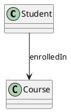

# TTL to PlantUML

A tool to convert **TTL (Turtle/RDF) ontology files** into **PlantUML diagrams**, helping visualize semantic models and relationships defined in RDF-based knowledge graphs.

The project reads a `.ttl` file, extracts classes, properties, relationships, named individuals and generates a PlantUML-compatible representation that can be rendered as UML diagrams.

## Features

* Convert Turtle (`.ttl`) ontology files into PlantUML format.
* Visualize RDF classes and named individuals and relationships as UML diagrams.
* Support ontology exploration and documentation.
* Lightweight command-line interface.

## Requirements

* Python 3.x
* Required Python dependencies (install if needed):

```bash
pip install -r requirements.txt
```


* For dependencies activate a virtual enviroment
```
py -m venv venv

.\venv\Scripts\activate.bat

pip install -r requirements.txt
```

* Install ontogram

```
pip show ontogram
pip install ontogram
```
If you are using the VSC console, please, after installation, please restart it


## Usage

Run the converter by providing the path to a TTL file:

```bash
python .\ttl_to_plantUML.py .\tests\input_files\test_univ_ontology\20190034_20190186_20190123_20190248_v1.ttl
```

The tool will process the ontology file and generate the corresponding PlantUML representation.


## Input Example

Example input file:

```
ontology.ttl
```

Containing RDF/Turtle definitions:

```ttl
:Student a owl:Class .

:Course a owl:Class .

:enrolledIn a owl:ObjectProperty ;
    rdfs:domain :Student ;
    rdfs:range :Course .
```

## Output Example

The generated PlantUML output represents the ontology structure:



The resulting `.txt` file can be rendered using PlantUML tools (like https://plantuml-editor.kkeisuke.com/) or extensions available for IDEs. 


## Project Structure

```
.
├── ttl_to_plantUML.py       # Main converter script
├── tests/
│   └── input_files/         # Example TTL input files
└── README.md
```

## Motivation

Ontologies and RDF knowledge graphs are powerful for representing complex domains, but understanding their structure can be challenging. This project provides a simple bridge between semantic models and UML visualization, making ontology structures easier to analyze and communicate.

## License

Add your preferred license information here.

